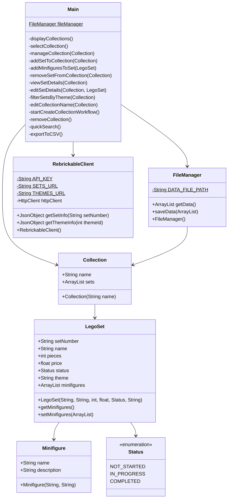

# LEGO Set Collection Manager

This assignment project allows users to manage and organise LEGO collections. Users can create and manage multiple LEGO collections, track individual sets, and maintain information about minifigures.

## Features

- Create and manage multiple LEGO collections
- Add/remove LEGO sets to collections
- Smart data entry with Rebrickable API integration:
  - Auto-fills set name, number of pieces, and theme
  - Uses official LEGO theme categories to ensure consistency
  - Manual override available for all fields
- Track set details such as:
  - Set number
  - Name (auto-filled)
  - Number of pieces (auto-filled)
  - Theme (auto-filled)
  - Price
  - Status (e.g. Not Started, In Progress, Completed)
- Manage minifigures associated with each set
- Filter sets by theme
- Quick search functionality
- Export collection data to CSV format

## Data Structure

### JSON File (data.json)

The `data.json` file stores the collection data in JSON format. It contains an array of Collection objects, each with a name and an array of LegoSet objects.

Example structure:

```json
[
    {
        "name": "Star Wars Collection",
        "sets": [
            {
                "setNumber": "75192",
                "name": "Millennium Falcon",
                "pieces": 7541,
                "price": 749.99,
                "status": "NOT_STARTED",
                "theme": "Ultimate Collector Series",
                "minifigures": [
                    {
                        "name": "Han Solo",
                        "description": "Smuggler"
                    }
                ]
            }
        ]
    }
]
```

### CSV File (lego_collections.csv)

The CSV file is generated for statistical analysis and contains the following columns:

- Collection: Name of the collection the set belongs to
- SetNumber: Unique set identifier
- Name: Set name
- Theme: Set theme
- Pieces: Number of pieces in the set
- Price: Set purchase price
- Status: Build status (NOT_STARTED, IN_PROGRESS, COMPLETED)
- Minifigure Name: Singular minifigure's name
- Minifigure Description: Singular minifigure's description


Example:

```csv
Collection,      SetNumber, Name,                Theme,          Pieces, Price,  Status,       Minifigure Name, Minifigure Description
"My Collection", "75192",   "Millennium Falcon", "Star Wars",    7541,   749.99, "COMPLETED",  "Han Solo",      "Smuggler"
"My Collection", "75192",   "Millennium Falcon", "Star Wars",    7541,   749.99, "COMPLETED",  "Chewbacca",     "Wookiee"
"My Wishlist",   "10276",   "Colosseum",         "Architecture", 9036,   549.99, "NOT_STARTED",,
```

> **Note:** Sets with several minifigures will have separate rows, with `Minifigure Name` and `Minifigure Description` varying accordingly.

## Class Diagram

The diagram below shows the structure and relationships of the main classes in the application. The `Main` class is the entry point and  with `Collection`, `FileManager`, and `RebrickableClient`. Each `Collection` contains multiple `LegoSet` objects, which in turn can have multiple `Minifigure` objects. The `Status` enum is used by `LegoSet` to represent the build status of a set.



## Usage Guide

### Viewing collections
  1. Select "View collections"
  2. This displays all existing collections with their set counts

### Creating a collection
  1. Select "View collections"
  2. Select "Add new collection"
  3. Enter a name for your collection

### Removing a collection
  1. Select "Remove collection" from the main menu
  2. Choose the collection you want to delete

### Managing sets in a collection
  1. Select "View collections"
  2. Select "View/manage collection"
  3. Enter a collection to manage
  4. You can then: Add new sets, Remove sets, View set details, Filter sets by theme

### Adding sets
  1. Within a collection, choose "Add new set"
  2. Enter the set number (e.g., "42172")
  3. Review the suggested data for auto-fill (if available)
  4. Enter the purchase price
  5. Select the set's status (Not Started/In Progress/Completed)

### Removing sets
  1. Within a collection, select "Remove set"
  2. Choose the set you want to remove

### Quick searching
  1. From the main menu, select "Quick search by set number"
  2. Enter a set number to view its details
  3. This will return set details if found within your collections

### Exporting data
  1. Select "Export to CSV" from the main menu
  2. All data will be saved to a CSV file

### Generating Statistics

1. Ensure you have Python installed with the following libraries:
    1. `plotly` (install with `pip3 install plotly`)
    2. `pandas` (install with `pip3 install pandas`)
2. After using the Java application to manage your collections, run the stats script:
   ```
   python3 stats.py
   ```
3. The script will generate visualisations of your LEGO collection data.

## Troubleshooting

### Common Issues

1. **Problem**: Unable to fetch set information from the Rebrickable API
   - Error message: "Could not fetch set information. Please enter manually."
   - Diagnostic steps:
     1. Verify that the Rebrickable API key is correctly set in `RebrickableClient.java`
     2. Ensure the set number entered is valid and exists in the Rebrickable database
   - Solution: If the issue continues, manually enter the set information when prompted

2. **Problem**: Data file not found or empty
   - Error message: "The data file is empty. Please add some collections first."
   - Diagnostic steps:
     1. Check if `data.json` exists in the `assignment4/src/main/java/com/lukecheskin/` directory
   - Solution: If the file is missing, the application will create a new one automatically. Add a new collection to populate the file.

3. **Problem**: Unable to generate statistics
   - Error message: "You must first run the program to generate the CSV file (lego_collections.csv)"
   - Diagnostic steps:
     1. Ensure you have run the Java application and exported data to CSV
     2. Check if `lego_collections.csv` exists in the project root directory
   - Solution: Run the Java application, add some collections and sets, then use the "Export to CSV" option before running `stats.py`